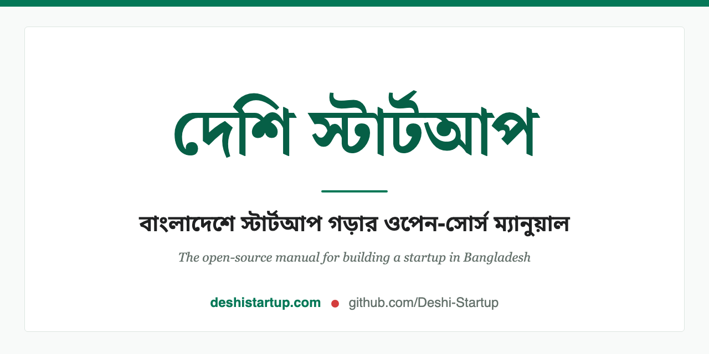

<div align="center">

<a href="https://deshistartup.com"></a>

# দেশি স্টার্টআপ

**বাংলাদেশে স্টার্টআপ গড়ার ওপেন-সোর্স ম্যানুয়াল**

আইডিয়া যাচাই থেকে কোম্পানি রেজিস্ট্রেশন, পেমেন্ট, প্রথম গ্রাহক, ফান্ডিং – প্রতিটি ধাপের
বাস্তব, সূত্রভিত্তিক গাইড, সহজ বাংলায়।

*The open-source manual for building a startup in Bangladesh.*
**[English README →](./README.en.md)**

### 📖 [deshistartup.com-এ পড়ুন →](https://deshistartup.com)

[](https://github.com/Deshi-Startup/deshistartup/stargazers)
[](https://deshistartup.com/sitemap)
[](https://github.com/Deshi-Startup/deshistartup/graphs/contributors)
[](./LICENSE-content.md)
[](./LICENSE)

</div>

---

## এই প্রজেক্টটি কেন

উইকিপিডিয়া প্রতিটি ভাষার মানুষকে একটি বিশ্বকোষ দিয়েছে। কিন্তু বাংলাদেশের ফাউন্ডাররা আজও শেখেন
ছড়ানো ফেসবুক পোস্ট, দামি কনসালট্যান্ট আর সিলিকন ভ্যালির এমন পরামর্শ থেকে, যা RJSC অফিসে পা
দেওয়ার পর আর কাজে লাগে না।

দেশি স্টার্টআপ সেই ফাঁক পূরণ করছে। **কী করবেন, কোথায় যাবেন, খরচ কত, কোন আইন প্রযোজ্য** – সব
এক জায়গায়, সরকারি সূত্রসহ, যে ভাষায় আপনি ভাবেন সেই ভাষায়। এসএসসি পাস শিক্ষার্থী যেন বুঝতে
পারে, আবার সিরিয়াস ফাউন্ডার যেন কাজের চেকলিস্ট হিসেবে ব্যবহার করতে পারে – লক্ষ্যটা এই।

## অগ্রগতি

**৪৪০+ পরিকল্পিত পাতার মধ্যে লেখা শেষ ৬৮টি** (লাইভ সংখ্যা ওপরের ব্যাজে)। বাকি ৩৭০+ বিষয়
সাইটে সৎভাবে "লেখা বাকি" চিহ্নিত – ভুয়া কোনো পাতা নেই। প্রতিটি অলেখা বিষয়ের জন্য দরকার
এমন একজন, যিনি কাজটা নিজে করেছেন বা ঠিকমতো রিসার্চ করতে জানেন।

**পরের গাইডটা কি আপনি লিখবেন?** [কী কী লেখা বাকি, দেখুন →](https://github.com/Deshi-Startup/deshistartup/issues)

## অবদান রাখুন

কোড জানার দরকার নেই। GitHub অ্যাকাউন্ট আর একটা ব্রাউজার থাকলেই হয়।

| সময় | কী করবেন | কীভাবে |
|---|---|---|
| ২ মিনিট | ভুল বা পুরোনো তথ্য জানান | যেকোনো পাতার **"ভুল জানান"** লিংকে ক্লিক করুন, বা [এখানে ইস্যু খুলুন](https://github.com/Deshi-Startup/deshistartup/issues/new?template=report-mistake.yml) |
| ৫–১০ মিনিট | বানান, লিংক বা একটি বাক্য ঠিক করুন | পাতার **"সম্পাদনা"** লিংকে ক্লিক করুন – ব্রাউজারেই হয়ে যাবে |
| কয়েক ঘণ্টা | একটি "লেখা বাকি" বিষয়ে পূর্ণ গাইড লিখুন | ["নতুন গাইড" ইস্যু থেকে বেছে নিন](https://github.com/Deshi-Startup/deshistartup/issues?q=is%3Aissue+is%3Aopen+label%3A%22নতুন+গাইড%22) বা [ব্যাকলগ দেখুন](./plan/content-backlog.csv) |

ধাপে ধাপে নির্দেশনা: সাইটের [কীভাবে অবদান রাখবেন](https://deshistartup.com/contribute) পাতা
আর [CONTRIBUTING.md](./CONTRIBUTING.md)।

লেখার মান দুটি ডকুমেন্টে বাঁধা: [STYLE.md](./STYLE.md) (বাংলা যেন বাংলাই শোনায়) আর
[EDITORIAL.md](./EDITORIAL.md) (পাতা যেন সত্যিই শেখায়)। যান্ত্রিক ভুলগুলো `npm run lint:bangla`
নিজেই ধরে দেয় – ভাষা নিখুঁত না হলেও শুরু করুন, রিভিউতে গুছিয়ে নেওয়া যায়।

**আমাদের প্রতিশ্রুতি:** প্রতিটি ইস্যু ও পুল রিকোয়েস্টের প্রথম জবাব ৪৮ ঘণ্টার মধ্যে।

## ভেতরে কী আছে

- 🧭 **[শুরু করুন](https://deshistartup.com/start-here)** – পুরো যাত্রার রোডম্যাপ ও শব্দকোষ
- 🛤️ **[কোন পথে যাবেন](https://deshistartup.com/journeys)** – ১২টি লক্ষ্যভিত্তিক গাইডেড পথ ("আইডিয়া আছে কিন্তু পণ্য নেই"…)
- ✅ **[আইডিয়া যাচাই](https://deshistartup.com/idea-validation)** – কাস্টমার ইন্টারভিউ, মার্কেট সাইজ, এমভিপি
- 🏛️ **ধাপ ১–৪** – রেজিস্ট্রেশন ও ভিত্তি → প্রোডাক্ট ও টিম → বিক্রি ও ফান্ডিং → স্কেল ও ইকোসিস্টেম
- 📚 **[কেস স্টাডি](https://deshistartup.com/case-studies)** – পাঠাও, বিকাশ, চালডাল… সূত্রভিত্তিক দেশি গল্প
- 🗂️ **[ডিরেক্টরি](https://deshistartup.com/directory)** – ইনভেস্টর ও অ্যাক্সেলারেটর, যাচাই-করা ডেটা হিসেবে
- 🌙 **[ফাউন্ডার লাইফ](https://deshistartup.com/founder-life)** – পরিবারের চাপ, মানসিক স্বাস্থ্য, একা-ফাউন্ডারের বাস্তবতা

## কেন বিশ্বাস করবেন

এই সাইট মোটিভেশনাল ব্লগ নয়, রেফারেন্স ম্যানুয়াল। মান ধরে রাখতে যা যা আছে:

- আইন, ফি ও নিয়মের প্রতিটি দাবিতে **সূত্র** – সরকারি পোর্টাল (RJSC, NBR, বাংলাদেশ ব্যাংক) আগে
- প্রতিটি ফি ও সংখ্যায় **সাল** ("২০২৬ সালের হিসাবে…") – পুরোনো তথ্য যেন পুরোনো বলেই ধরা পড়ে
- কমপ্লায়েন্স পাতায় আলাদা **"সর্বশেষ যাচাই"** তারিখ, আর [plan/maintenance-calendar.md](./plan/maintenance-calendar.md) ধরে নিয়মিত পুনঃযাচাই
- **ধরাবাঁধা মান:** [STYLE.md](./STYLE.md) + [EDITORIAL.md](./EDITORIAL.md) + স্বয়ংক্রিয় লিন্টার – রিভিউ ছাড়া আইনি/কর পাতা প্রকাশ হয় না
- লেখার কাজে আমরা AI ব্যবহার করি, মান ঠিক করে মানুষ – প্রক্রিয়া, ব্যাকলগ, সোর্স রেজিস্ট্রি সবই প্রকাশ্য ([plan/](./plan/))

তবু মনে রাখুন: এই সাইট সাধারণ গাইড, আইনি বা কর পরামর্শ নয়। বড় সিদ্ধান্তের আগে সরকারি উৎস বা
পেশাদারের সঙ্গে যাচাই করে নিন।

## যাঁরা বানাচ্ছেন

<a href="https://github.com/Deshi-Startup/deshistartup/graphs/contributors"></a>

আপনার ছবিও এখানে আসবে – প্রথম অবদানটা আজই করে দেখুন।

## পরিকল্পনা ও পরিচালনা

আমাদের পুরো পরিকল্পনা প্রকাশ্য – কী লেখা হবে, কোন সূত্র বিশ্বাসযোগ্য, কবে কী পুনঃযাচাই হবে:

- [plan/](./plan/) – কনটেন্ট ব্যাকলগ (৩৯০+ বিষয়), টায়ার-করা সোর্স রেজিস্ট্রি, মেইনটেন্যান্স ক্যালেন্ডার
- [plan/vision.md](./plan/vision.md) – বিস্তারিত ভিশন, কনটেন্ট নীতিমালা, সাফল্যের সংজ্ঞা
- [AGENTS.md](./AGENTS.md) – সাইটের আর্কিটেকচার ও কনভেনশন (ডেভেলপার ও AI এজেন্টদের জন্য)
- [Discussions](https://github.com/Deshi-Startup/deshistartup/discussions) – প্রশ্ন, আইডিয়া, আলোচনা

## ডেভেলপারদের জন্য

```bash
npm install
npm run dev
```

স্ট্যাক: [Next.js](https://nextjs.org/) (static export) + [Nextra](https://nextra.site/) +
[Pagefind](https://pagefind.app/) সার্চ, কাস্টম উইকি-শেল। আর্কিটেকচার ও কনভেনশন:
[AGENTS.md](./AGENTS.md)। মনে রাখুন – কনটেন্টে অবদান রাখতে এসবের কিছুই লাগে না, ব্রাউজারই যথেষ্ট।

## লাইসেন্স

- **কনটেন্ট** (সব গাইড, কেস স্টাডি, ডিরেক্টরি): [CC BY-SA 4.0](./LICENSE-content.md) – উইকিপিডিয়ার লাইসেন্স। সূত্র উল্লেখ করে যে কেউ কপি, অনুবাদ ও পুনঃপ্রকাশ করতে পারে, একই লাইসেন্সে।
- **কোড:** [MIT](./LICENSE)।

Attribution ফরম্যাট: *"দেশি স্টার্টআপ – deshistartup.com, CC BY-SA 4.0"*

---

<div align="center">

⭐ **ভালো লাগলে একটা স্টার দিন** – এক ক্লিকেই এই জ্ঞানভাণ্ডার আরও মানুষের কাছে পৌঁছায়।

*মাতৃভাষায় জ্ঞান – সবার জন্য, আজীবন ফ্রি।*

</div>
