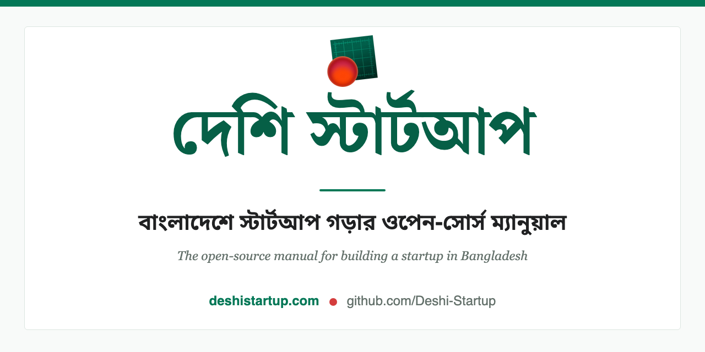

<div align="center">

<a href="https://deshistartup.com"></a>

# দেশি স্টার্টআপ

**বাংলাদেশে স্টার্টআপ গড়ার ফ্রি, ওপেন-সোর্স ম্যানুয়াল**

[সাইটে পড়ুন](https://deshistartup.com) · [English README](./README.en.md)

</div>

## কেন এই প্রজেক্ট

বাংলাদেশে স্টার্টআপ বানাতে গেলে একই প্রশ্ন বারবার সামনে আসে। আইডিয়াটা মানুষ আসলেই চায়
কি না বুঝবেন কীভাবে? কোম্পানি রেজিস্ট্রেশন কোথা থেকে শুরু করবেন? পেমেন্ট নেবেন কোন পথে?
প্রথম গ্রাহক পাবেন কোথায়?

উত্তর আছে, তবে এক জায়গায় নেই। কিছু তথ্য সরকারি পোর্টালে, কিছু রিপোর্ট বা ভিডিওতে,
আর অনেক কিছু ছড়িয়ে আছে ফেসবুক পোস্ট ও মানুষের অভিজ্ঞতায়। বিদেশি গাইডে ভালো ধারণা
থাকলেও বাংলাদেশের অফিস-আদালত, বাজার, পেমেন্ট ব্যবস্থা আর মানুষের আস্থা তৈরির ধরন
আলাদা। তাই সব পরামর্শ এখানে খাটে না।

দেশি স্টার্টআপে আমরা এই ছড়ানো তথ্য যাচাই করে কাজে লাগানোর মতো বাংলায় বুঝিয়ে বলি।
পাঠক আইন-কানুন, হিসাব বা স্টার্টআপের ভাষা আগে থেকেই জানেন, আমরা এমন ধরে নিই না।
লক্ষ্য হলো, প্রথমবারের একজন ফাউন্ডার যেন পেজটি পড়ে বুঝতে পারেন এখন কী করবেন, কোথায়
যাবেন আর কোন তথ্য আবার মিলিয়ে নেবেন।

বাংলা মূল সংস্করণ। একই পেজের ইংরেজি সংস্করণ `/en/...` পথে পাওয়া যায়।

## কী পাবেন

- **[শুরু করুন](https://deshistartup.com/start-here):** আইডিয়া থেকে প্রথম কাজ পর্যন্ত
  কোথায় কী করবেন, তার রোডম্যাপ।
- **[বিষয়ভিত্তিক গাইড](https://deshistartup.com/guides):** রেজিস্ট্রেশন, কর, পেমেন্ট,
  গ্রাহক, অপারেশনস, টিম, ফান্ডিংসহ সব বিভাগ।
- **[কোন পথে যাবেন](https://deshistartup.com/journeys):** এখন যে কাজটি করতে চান, সে
  অনুযায়ী কোন গাইডের পর কোনটি পড়বেন।
- **[টেমপ্লেট ও টুল](https://deshistartup.com/tools):** কপি করে ব্যবহার করা যায় এমন
  স্ক্রিপ্ট, চেকলিস্ট ও ক্যালকুলেটর।
- **[কেস স্টাডি](https://deshistartup.com/case-studies):** বাংলাদেশের স্টার্টআপগুলো কীভাবে
  শুরু করেছে, কোথায় আটকে গেছে আর কী শেখা যায়।
- **[ডিরেক্টরি](https://deshistartup.com/directory):** ইনভেস্টর ও অ্যাক্সেলারেটরের
  সূত্রসহ তালিকা।
- **[ফাউন্ডার লাইফ](https://deshistartup.com/founder-life):** পরিবারের চাপ, মানসিক স্বাস্থ্য
  আর একা কোম্পানি গড়ার মতো কম আলোচিত বিষয়।

সাইটটি এখনো লেখা হচ্ছে। কোনো বিষয় শেষ না হলে আমরা সেটিকে **লেখা বাকি** বলেই দেখাই,
পূর্ণ গাইডের ভান করি না। কতগুলো পেজ শেষ হয়েছে, তার বর্তমান হিসাব
[সাইটম্যাপে](https://deshistartup.com/sitemap) আছে।

## অবদান রাখুন

নিয়ম, ফি আর বাস্তব অভিজ্ঞতা বদলায়। তাই এই জ্ঞানভাণ্ডার ঠিক রাখতে অনেক মানুষের চোখ
দরকার। আপনার অবদান বড় হতে হবে না:

| আপনি যা করতে পারেন | কীভাবে করবেন |
|---|---|
| ভুল, পুরোনো তথ্য বা নষ্ট লিংক জানান | পেজের **ফিডব্যাক দিন** অপশন ব্যবহার করুন |
| বানান, লিংক বা একটি বাক্য ঠিক করুন | **এডিট** চাপুন, Google দিয়ে সাইন ইন করে ব্রাউজারেই বদলান |
| একটি লেখা বাকি বিষয়কে পূর্ণ গাইড বানান | বিষয়টি বেছে রিসার্চ করুন, তারপর রিভিউতে পাঠান |

কোড জানা লাগে না। প্রথম খসড়ার ভাষাও নিখুঁত হতে হবে না। তথ্য ঠিক আছে কি না, সূত্র আছে
কি না এবং পাঠক কী করবেন তা বোঝা যাচ্ছে কি না, এগুলোই আগে দেখা হবে।

ধাপে ধাপে জানতে [অবদান পেজটি](https://deshistartup.com/contribute) পড়ুন। GitHub-এ
কাজ করতে চাইলে বিস্তারিত আছে [CONTRIBUTING.md](./CONTRIBUTING.md)-এ।

## কেন ভরসা করবেন

- আইন, ফি, কর ও নিয়মের দাবিতে সরকারি বা মূল সূত্র আগে ব্যবহার করি।
- বদলাতে পারে এমন ফি, সীমা ও সংখ্যার সঙ্গে সাল বা যাচাইয়ের তারিখ দিই।
- সাধারণ সম্পাদনার তারিখ আর নিয়মকানুনের তথ্য শেষ কবে মিলিয়ে দেখা হয়েছে, দুটো আলাদা
  করে দেখাই।
- লেখা প্রকাশের আগে রিভিউ হয়। কী বদলেছে, তার ইতিহাস GitHub-এ খোলা থাকে।
- অসম্পূর্ণ পেজকে সার্চে পূর্ণ গাইড হিসেবে দেখাই না।
- লেখার কাজে এআই সাহায্য করতে পারে, তবে তথ্য ও ভাষা ঠিক আছে কি না এবং কী প্রকাশ হবে,
  তার শেষ সিদ্ধান্ত মানুষ নেন।

তবু এটি সরকারি সেবা বা ব্যক্তিগত আইনি ও কর পরামর্শ নয়। বড় সিদ্ধান্ত নেওয়ার আগে
চলতি সরকারি তথ্য মিলিয়ে নিন, দরকার হলে আইনজীবী, সিএ বা উপযুক্ত পেশাজীবীর সঙ্গে কথা বলুন।

## পরিকল্পনাও উন্মুক্ত

কী লেখা হবে, কোন সূত্র আগে ব্যবহার করব আর কোন তথ্য কখন আবার যাচাই করব, সবই এই
রিপোজিটরিতে দেখা যায়:

- [পরিকল্পনা ও ব্যাকলগ](./plan/)
- [প্রজেক্টের লক্ষ্য](./plan/vision.md)
- [অবদান রাখার নিয়ম](./CONTRIBUTING.md)
- [নিরাপত্তার দুর্বলতা জানানোর নিয়ম](./SECURITY.md)
- [Discussions](https://github.com/Deshi-Startup/deshistartup/discussions)

## ডেভেলপারদের জন্য

```bash
npm install
npm run dev
```

কোডের মানচিত্র, দরকারি কমান্ড ও নিরাপত্তার নিয়ম [AGENTS.md](./AGENTS.md)-এ আছে।
কনটেন্টে অবদান রাখতে এই টেক স্ট্যাক জানা লাগে না।

## লাইসেন্স

- `app/(contents)/`-এর লেখা: [CC BY-SA ৪.০](./LICENSE-content.md)
- কোড: [MIT](./LICENSE)

লেখা ব্যবহার করলে উৎস দিন এভাবে:
`দেশি স্টার্টআপ – deshistartup.com, CC BY-SA 4.0`
